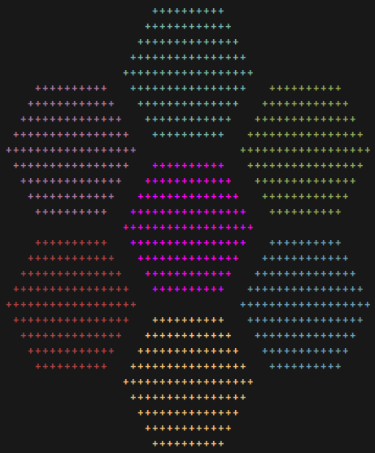

# Sketch

    

Sketch is the terminal painting program you've never asked for.

### Features

 - Line and box drawing
 - Text input and copy/paste
 - Adjustable brush sizes and characters
 - Customizable text styles with truecolor support
 - "Paint Bucket" area filling
 - Linear history for undo/redo

## Demo

https://github.com/user-attachments/assets/2fde2d86-810e-4044-9621-552c277e5588
